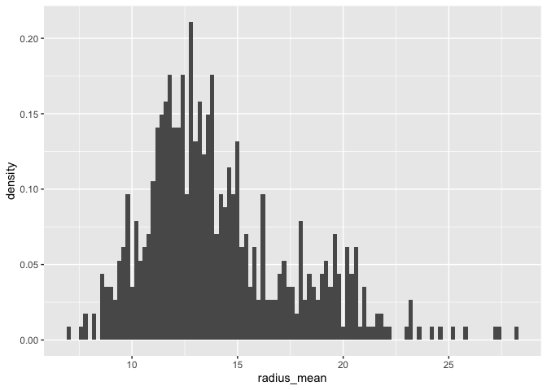
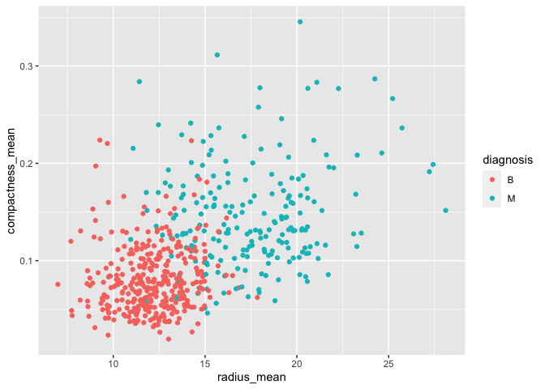
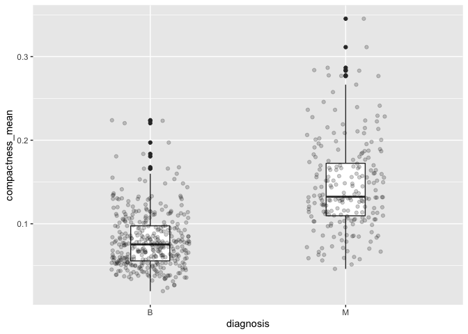
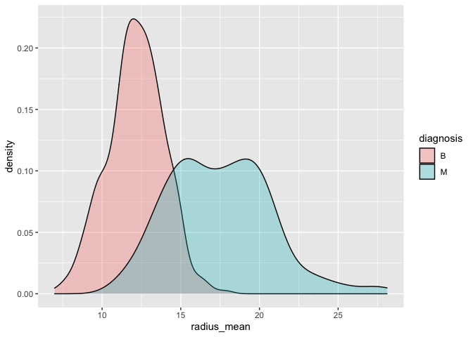

STAT 545A Milestone 1 for Mini Data Analysis
================
Jiahao Li (50462670)

``` r
library(datateachr)
library(tidyverse)
```

    ## ── Attaching packages ─────────────────────────────────────── tidyverse 1.3.1 ──

    ## ✓ ggplot2 3.3.5     ✓ purrr   0.3.4
    ## ✓ tibble  3.1.5     ✓ dplyr   1.0.7
    ## ✓ tidyr   1.1.4     ✓ stringr 1.4.0
    ## ✓ readr   2.0.2     ✓ forcats 0.5.1

    ## ── Conflicts ────────────────────────────────────────── tidyverse_conflicts() ──
    ## x dplyr::filter() masks stats::filter()
    ## x dplyr::lag()    masks stats::lag()

## Task 1: Choose your favorite dataset (10 points)

### Candidate 1: `steam_games`

``` r
print(class(steam_games))
```

    ## [1] "spec_tbl_df" "tbl_df"      "tbl"         "data.frame"

``` r
print(dim(steam_games))
```

    ## [1] 40833    21

``` r
print(colnames(steam_games))
```

    ##  [1] "id"                       "url"                     
    ##  [3] "types"                    "name"                    
    ##  [5] "desc_snippet"             "recent_reviews"          
    ##  [7] "all_reviews"              "release_date"            
    ##  [9] "developer"                "publisher"               
    ## [11] "popular_tags"             "game_details"            
    ## [13] "languages"                "achievements"            
    ## [15] "genre"                    "game_description"        
    ## [17] "mature_content"           "minimum_requirements"    
    ## [19] "recommended_requirements" "original_price"          
    ## [21] "discount_price"

### Candidate 2: `cancer_sample`

``` r
print(class(cancer_sample))
```

    ## [1] "spec_tbl_df" "tbl_df"      "tbl"         "data.frame"

``` r
print(dim(cancer_sample))
```

    ## [1] 569  32

``` r
print(colnames(cancer_sample))
```

    ##  [1] "ID"                      "diagnosis"              
    ##  [3] "radius_mean"             "texture_mean"           
    ##  [5] "perimeter_mean"          "area_mean"              
    ##  [7] "smoothness_mean"         "compactness_mean"       
    ##  [9] "concavity_mean"          "concave_points_mean"    
    ## [11] "symmetry_mean"           "fractal_dimension_mean" 
    ## [13] "radius_se"               "texture_se"             
    ## [15] "perimeter_se"            "area_se"                
    ## [17] "smoothness_se"           "compactness_se"         
    ## [19] "concavity_se"            "concave_points_se"      
    ## [21] "symmetry_se"             "fractal_dimension_se"   
    ## [23] "radius_worst"            "texture_worst"          
    ## [25] "perimeter_worst"         "area_worst"             
    ## [27] "smoothness_worst"        "compactness_worst"      
    ## [29] "concavity_worst"         "concave_points_worst"   
    ## [31] "symmetry_worst"          "fractal_dimension_worst"

### Candidate 3: `parking_meters`

``` r
print(class(parking_meters))
```

    ## [1] "tbl_df"     "tbl"        "data.frame"

``` r
print(dim(parking_meters))
```

    ## [1] 10032    22

``` r
print(colnames(parking_meters))
```

    ##  [1] "meter_head"     "r_mf_9a_6p"     "r_mf_6p_10"     "r_sa_9a_6p"    
    ##  [5] "r_sa_6p_10"     "r_su_9a_6p"     "r_su_6p_10"     "rate_misc"     
    ##  [9] "time_in_effect" "t_mf_9a_6p"     "t_mf_6p_10"     "t_sa_9a_6p"    
    ## [13] "t_sa_6p_10"     "t_su_9a_6p"     "t_su_6p_10"     "time_misc"     
    ## [17] "credit_card"    "pay_phone"      "longitude"      "latitude"      
    ## [21] "geo_local_area" "meter_id"

### Candidate 4: `vancouver_trees`

``` r
print(class(vancouver_trees))
```

    ## [1] "tbl_df"     "tbl"        "data.frame"

``` r
print(dim(vancouver_trees))
```

    ## [1] 146611     20

``` r
print(colnames(vancouver_trees))
```

    ##  [1] "tree_id"            "civic_number"       "std_street"        
    ##  [4] "genus_name"         "species_name"       "cultivar_name"     
    ##  [7] "common_name"        "assigned"           "root_barrier"      
    ## [10] "plant_area"         "on_street_block"    "on_street"         
    ## [13] "neighbourhood_name" "street_side_name"   "height_range_id"   
    ## [16] "diameter"           "curb"               "date_planted"      
    ## [19] "longitude"          "latitude"

### Choice 1: `steam_games`

I selected this dataset because I am a deep PC game lover and a steam
game collector. Every time when promotion season comes close, such as
Thanksgiving or Christmas, I would buy a bunch of steam games on
discount to enrich my steam libraries. By analyzing this `steam_games`
dataset, I would have the chance to explore the relationship between
discount and other attributes so that I can adjust my purchase strategy
regarding the optimal timing to buy a game.

### Potential Research Topic of `steam_games`

The relationship between the game and the promotion intensity, which
could be a purchase strategy for steam game collectors, and also be a
deduction on company’s market startegy.

### Choice 2: `cancer_sample`

Cancer is still one of the biggest enemies to human beings. The
`cancer_sample` dataset contains all kinds of parameters of cancer cell
and the property of the tumor. Analysis on this dataset may offer a
perspective on prediction of the tumor, which may contribute to cancer
research and treatment.

### Potential Research Topic of `cancer_sample`

The relationship between the various parameters of the cancer cell and
the properties of the tumor, which can be used as a prediction method
for tumor prevention and treatment. The exploration on relationships
between variables could also be the selection of features for machine
learning purpose.

### Final Choice: `cancer_sample`

As I mentioned above, Analysis on this dataset may offer a perspective
on prediction of the tumor, which may contribute to cancer research and
treatment. Besides, I have a little background on nano biology, which
might be helpful to this data analysis project.

## Task 2: Exploring your dataset (15 points)

### 1. Plot the distribution of a numeric vairable

``` r
distribution_of_radius <- ggplot(cancer_sample, aes(radius_mean, ..density..)) +
    geom_histogram(binwidth = 0.2)
print(distribution_of_radius)
```

<!-- -->

The distribution of the radius of cancer cells can offer a perspective
on large a normal cancer cell could be, based on which the doctor can
make a simple deduction if the patient has cancer or not via a routine
inspection.

### 4. Explore the relationship between 2 variables in a plot

``` r
radius_vs_compactness <- ggplot(cancer_sample, aes(radius_mean, compactness_mean)) +
    geom_point(aes(color = diagnosis))
print(radius_vs_compactness)
```

<!-- -->

This plot is aimed to explore how cancer cells are arranged in human
tissue. As the radius of cancer cells increase, is the compactness of
the cells increase or descrease? Based on the plot above, there seems no
particular relationship between these 2 variables. However, it shows
that there does exist a relationship betweem the cell radius and the
final diagnosis. Radius less than 15 are mostly classified as B, while
more than 15 are mostly classified as M.

### 6. Use a boxplot to look at the frequency of different observations within a single variable

``` r
boxplot_of_compactness <- ggplot(cancer_sample, aes(diagnosis, compactness_mean)) +
    geom_boxplot(width = 0.2) +
    geom_jitter(width = 0.2, alpha = 0.2)
print(boxplot_of_compactness)
```

<!-- -->

The compactness of cells arrangement could be of great use in medical
imaging. Doctors may be able to make a simple deduction if the patient
has cancer or not via a routine imagine. In the plot above, it seems
that compactness aggregate on different values based on the diagnosis.
Compactness of cancer cells classified as B has smaller value. However,
this difference is not quite obvious.

### 8. Use a density plot to explore any of the variables

``` r
density_of_radius <- ggplot(cancer_sample, aes(radius_mean)) +
    geom_density(aes(fill = diagnosis), alpha = 0.3)
print(density_of_radius)
```

<!-- -->

This plot again explores the relationship between the distribution of
cancer cell radius and the final diagnosis. Apparently, cancer cells
diagnosis as B and M have their own independent normal distribution
curve. This coule also be very useful to make an initial deduction via a
routine diagnosis.

## Task 3: Write your research questions (5 points)

1.  Are these variables all independent (orthogonal) to each other? For
    example, is there any relationship between any two of these
    variables? If so, are we able to reduce the number of features by
    doing some principle component analysis (PCA)?
2.  The dataset does not mention which body part does these cancer
    sample come from. Would the data differs a lot for different body
    parts?
3.  What are the top 3 variables that could be most likely used for a
    simple diagnosis to determine whether the cancer is B or M?
4.  Is there any other data that could be derived from the given
    variables? Will the derived data contribute more to the final
    diagnosis of the cancer cells compared to the original variables?
