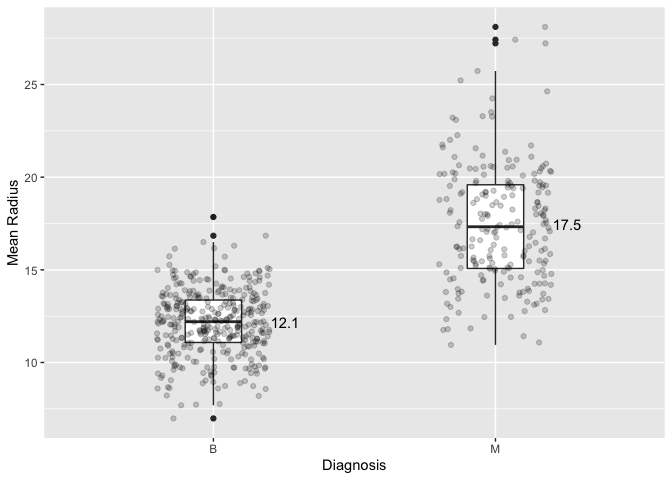
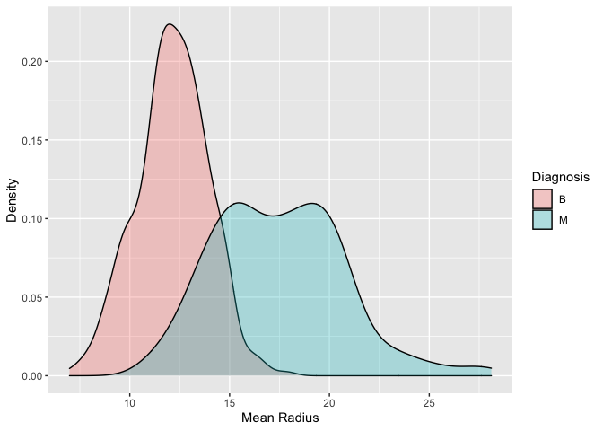
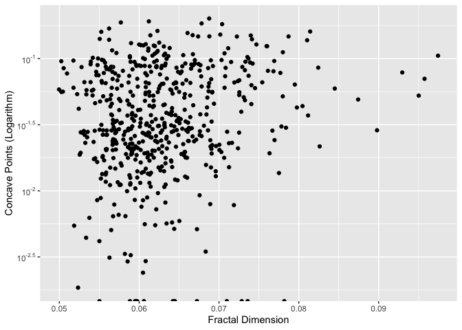
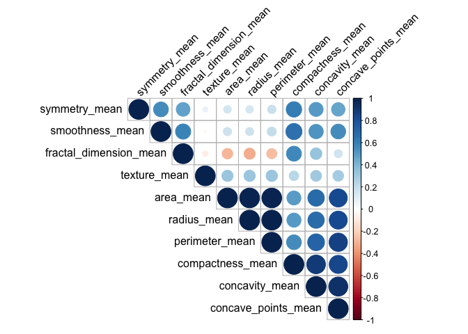
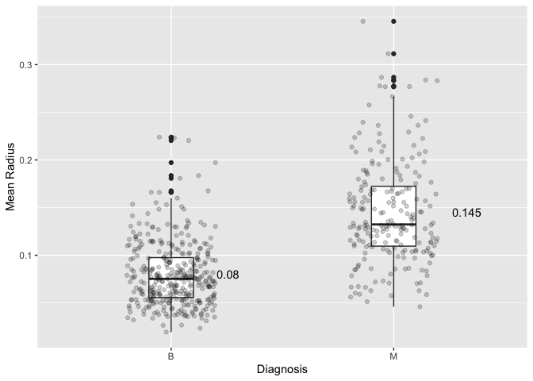
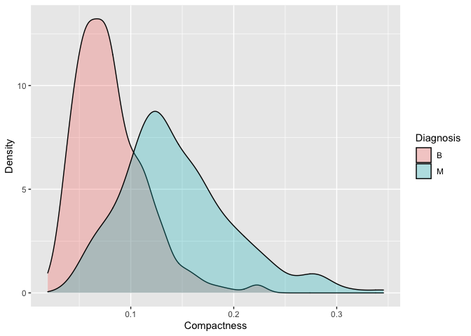
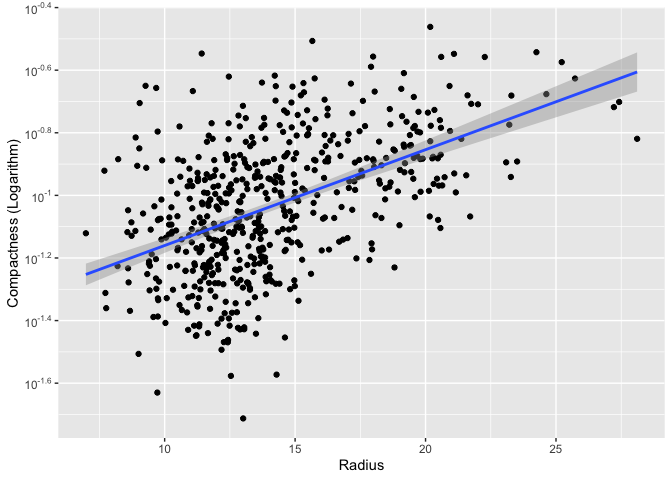

STAT 545A Milestone 2 for Mini Data Analysis
================
Jiahao Li (50462670)

``` r
suppressMessages(library(datateachr))
suppressMessages(library(tidyverse))
suppressMessages(library(scales))
suppressMessages(library(corrplot))
```

## Data Overview

To start with, I am going to post the basic metrics of `cancer_sample`
that I am going to work with throughout this data analysis project.

``` r
dim(cancer_sample)
```

    ## [1] 569  32

``` r
colnames(cancer_sample)
```

    ##  [1] "ID"                      "diagnosis"              
    ##  [3] "radius_mean"             "texture_mean"           
    ##  [5] "perimeter_mean"          "area_mean"              
    ##  [7] "smoothness_mean"         "compactness_mean"       
    ##  [9] "concavity_mean"          "concave_points_mean"    
    ## [11] "symmetry_mean"           "fractal_dimension_mean" 
    ## [13] "radius_se"               "texture_se"             
    ## [15] "perimeter_se"            "area_se"                
    ## [17] "smoothness_se"           "compactness_se"         
    ## [19] "concavity_se"            "concave_points_se"      
    ## [21] "symmetry_se"             "fractal_dimension_se"   
    ## [23] "radius_worst"            "texture_worst"          
    ## [25] "perimeter_worst"         "area_worst"             
    ## [27] "smoothness_worst"        "compactness_worst"      
    ## [29] "concavity_worst"         "concave_points_worst"   
    ## [31] "symmetry_worst"          "fractal_dimension_worst"

## Task 1: Process and Summarize the Data (15 points)

### 1.1 Review of Research Questions (2.5 points)

1.  Is there an obvious difference in radius between benign and
    malignant tumors?
2.  Are the variables concave points and fractal dimension related?
3.  Is compactness a valuable variable to determine whether a tumor is
    benign or malign?
4.  

### 1.2 Summarizing & Graphing (10 points)

#### Question 1

> Is there an obvious difference in radius between benign and malignant
> tumors?

##### Summarizing

> 1.  Compute the range, mean, and two other summary statistics of one
>     numerical variable across the groups of one categorical variable
>     from your data.

``` r
q1_sum <- cancer_sample %>%
  group_by(diagnosis) %>%
  summarise(mean = mean(radius_mean),
            min = min(radius_mean),
            max = max(radius_mean),
            median = median(radius_mean),
            standard = sd(radius_mean))
q1_sum
```

    ## # A tibble: 2 × 6
    ##   diagnosis  mean   min   max median standard
    ##   <chr>     <dbl> <dbl> <dbl>  <dbl>    <dbl>
    ## 1 B          12.1  6.98  17.8   12.2     1.78
    ## 2 M          17.5 11.0   28.1   17.3     3.20

##### Graphing

> 1.  Create a graph out of summarized variables that has at least two
>     geom layers.

``` r
q1_graph <- ggplot(cancer_sample, aes(diagnosis, radius_mean)) +
  geom_boxplot(width = 0.2) +
  geom_jitter(width = 0.2, alpha = 0.2) +
  geom_text(data = q1_sum, aes(y = mean, label = round(mean, 1)), hjust=-2) +
  labs(y = "Mean Radius", x = "Diagnosis")
q1_graph
```

<!-- -->

##### Analyzing

The summarizing table illustrates that every summary statistics of
malignant tumors are about 50% larger than that of benign tumors. The
boxplot graph also emphasizes this feature, but also shows an overlap
between these two kinds of samples. We can plot a density graph to take
a more intuitive look at the overlap:

``` r
q1_analysis <- ggplot(cancer_sample, aes(radius_mean)) + 
  geom_density(aes(fill = diagnosis), alpha = 0.3) +
  labs(y = "Density", x = "Mean Radius", fill = "Diagnosis")
q1_analysis
```

<!-- -->

The density graph shows that benign and malignant tumors have their own
independent normal distribution curve regarding to radius. Also, the
significant difference between these two curves make it more sense for
results of the above summarizing and graphing operations, which means
both of them helps answer the research question. However, it is also
worth noting that there is still a big overlap between benign and
malignant samples, which means that a diagnosis cannot be made based on
radius only.

#### Question 2

> Are the variables concave points and fractal dimension related?

##### Summarizing

> 1.  Compute the range, mean, and two other summary statistics of one
>     numerical variable across the groups of one categorical variable
>     from your data.

``` r
q2_sum <- cancer_sample %>%
  group_by(diagnosis) %>%
  summarise(mean = mean(fractal_dimension_mean),
            min = min(fractal_dimension_mean),
            max = max(fractal_dimension_mean),
            median = median(fractal_dimension_mean),
            standard_deviation = sd(fractal_dimension_mean))
q2_sum
```

    ## # A tibble: 2 × 6
    ##   diagnosis   mean    min    max median standard_deviation
    ##   <chr>      <dbl>  <dbl>  <dbl>  <dbl>              <dbl>
    ## 1 B         0.0629 0.0518 0.0958 0.0615            0.00675
    ## 2 M         0.0627 0.0500 0.0974 0.0616            0.00757

##### Graphing

> 6.  Create a graph of your choosing, make one of the axes logarithmic,
>     and format the axes labels so that they are “pretty” or easier to
>     read.

``` r
q2_graph <- ggplot(cancer_sample, aes(fractal_dimension_mean, concave_points_mean)) +
  geom_point() +
  scale_y_continuous(trans = "log10",
                     breaks = trans_breaks("log10", function(x) 10^x),
                     labels = trans_format("log10", math_format(10^.x))) +
  labs(y = "Concave Points (Logarithm)", x = "Fractal Dimension")
q2_graph
```

    ## Warning: Transformation introduced infinite values in continuous y-axis

<!-- -->

##### Analyzing

The research question asks for the relationship between two variables,
concave points and fractal dimension. However, the summarizing option
only selects one variable, which is obviously useless. However, the
graph above shows the distribution of concave points (y-axis) against
fractal dimension(x-axis). Y-axis is scaled in logarithm of 10. It can
be seen from the graph that the relationship between these two variables
is not quite intuitive. However, there is still a trend showing that as
fractal dimension increases, concave points increases as well.
Therefore, the graph indicates that there is a positive correlation
between these two variables.

To take a deeper look at the correlation among variables, we can plot a
correlation matrix to illustrate that:

``` r
sub_sample <- cancer_sample %>%
  select(radius_mean, perimeter_mean, area_mean, texture_mean, smoothness_mean, concavity_mean, symmetry_mean, compactness_mean, concave_points_mean, fractal_dimension_mean)

res <- cor(sub_sample)

corrplot(res, type = "upper", order = "hclust", tl.col = "black", tl.srt = 45)
```

<!-- -->

The correlation matrix shows that there are not many negative
correlations among these variables. It makes sense that area, radius,
perimeter, and concave points have very strong positive correlation to
each other for that they are mathematically related. It can also been
seen that there is a high positive correlation between concave points
and compactness. This correlation matrix makes it easy and intuitive to
see the relationship between each variables, which may contribute to
future study.

#### Question 3

> Is compactness a valuable variable to determine whether a tumor is
> benign or malign?

##### Summarizing

> 3.  Create a categorical variable with 3 or more groups from an
>     existing numerical variable.

``` r
q3_stat <- cancer_sample %>%
  group_by(diagnosis) %>%
  summarise(mean = mean(compactness_mean),
            min = min(compactness_mean),
            max = max(compactness_mean))
q3_stat
```

    ## # A tibble: 2 × 4
    ##   diagnosis   mean    min   max
    ##   <chr>      <dbl>  <dbl> <dbl>
    ## 1 B         0.0801 0.0194 0.224
    ## 2 M         0.145  0.0460 0.345

First I derive the summarizing statistics of commpactness so that I can
use the min, mean, and max value to classfy compactness from numeric to
categorical.

``` r
q3_classify <- cancer_sample %>%
  select(diagnosis, compactness_mean) %>%
  arrange(compactness_mean) %>%
  mutate(compactness = case_when (compactness_mean < 0.1 ~ "S",
  compactness_mean < 0.15 ~ "M",
  TRUE ~ "L"))

q3_sum <- count(q3_classify, diagnosis, compactness)
q3_sum
```

    ## # A tibble: 6 × 3
    ##   diagnosis compactness     n
    ##   <chr>     <chr>       <int>
    ## 1 B         L              14
    ## 2 B         M              72
    ## 3 B         S             271
    ## 4 M         L              85
    ## 5 M         M              91
    ## 6 M         S              36

##### Graphing

> 5.  Create a graph out of summarized variables that has at least two
>     geom layers.

``` r
q3_graph <- ggplot(cancer_sample, aes(diagnosis, compactness_mean)) +
  geom_boxplot(width = 0.2) +
  geom_jitter(width = 0.2, alpha = 0.2) +
  geom_text(data = q3_stat, aes(y = mean, label = round(mean, 3)), hjust=-2) +
  labs(y = "Mean Radius", x = "Diagnosis")
q3_graph
```

<!-- -->

##### Analyzing

It can be seen from the summarizing table that the number of ‘S’ benign
samples are significant larger than that of malign samples. Also the
number of ‘L’ benign samples are much smaller than that of malign
samples. This indicates that compactness does have its own value as a
reference to determine the property of a tumor. However, the graphing
part is less intuitive for that it is supposed to be a graph out of
summarized variables. Here I select mean, which is not that useful as
the difference between ‘M’ benign and malign tumors is very small. We
can plot a density graph to take a more intuitive look at the value of
compactness:

``` r
q3_analysis <- ggplot(cancer_sample, aes(compactness_mean)) + 
  geom_density(aes(fill = diagnosis), alpha = 0.3) +
  labs(y = "Density", x = "Compactness", fill = "Diagnosis")
q3_analysis
```

<!-- -->

It can be seen that there is still a big overlap between benign and
malignant samples, which means that extra variables are needed for the
final diagnosis.

#### Question 4

> Is there a linear relationship between redius and compactness?

##### Summarizing

> 1.  Compute the range, mean, and two other summary statistics of one
>     numerical variable across the groups of one categorical variable
>     from your data.

``` r
q4_sum <- cancer_sample %>%
  group_by(diagnosis) %>%
  summarise(mean = mean(compactness_mean),
            min = min(compactness_mean),
            max = max(compactness_mean),
            median = median(compactness_mean),
            standard_deviation = sd(compactness_mean))
q4_sum
```

    ## # A tibble: 2 × 6
    ##   diagnosis   mean    min   max median standard_deviation
    ##   <chr>      <dbl>  <dbl> <dbl>  <dbl>              <dbl>
    ## 1 B         0.0801 0.0194 0.224 0.0753             0.0337
    ## 2 M         0.145  0.0460 0.345 0.132              0.0540

##### Graphing

> 6.  Create a graph of your choosing, make one of the axes logarithmic,
>     and format the axes labels so that they are “pretty” or easier to
>     read.

``` r
q4_graph <- ggplot(cancer_sample, aes(radius_mean, compactness_mean)) +
  geom_point() +
  geom_smooth(method = lm, formula = y ~ x) +
  scale_y_continuous(trans = "log10",
                     breaks = trans_breaks("log10", function(x) 10^x),
                     labels = trans_format("log10", math_format(10^.x))) +
  labs(y = "Compactness (Logarithm)", x = "Radius")
q4_graph
```

<!-- -->

##### Analyzing

The research question asks for the relationship between two variables,
radius and compactness. However, the summarizing option only selects one
variable, which is obviously useless. However, the graph above shows the
distribution of compactness (y-axis) against radius (x-axis). Y-axis is
scaled in logarithm of 10. The straight line lies in the graph is the
fit of the relationship between radius and compactness, it can be seen
that the grey part around the line is not very thick, which means that
there is a linear relationship between the variable radius and
compactness.

### 1.3 Progress (2.5 points)

## Task 2: Tidy the Data (12.5 points)

### 2.1 Data Identify (2.5 points)

Here I select `diagnosis`, `radius_mean`, `texture_mean`,
`smoothness_mean`, `concavity_mean`, `symmetry_mean`,
`compactness_mean`, `fractal_dimension_mean` to check the dataset is
tidy or not:

``` r
q1 <- cancer_sample %>%
    select(diagnosis, radius_mean, texture_mean, smoothness_mean, concavity_mean, symmetry_mean, compactness_mean, fractal_dimension_mean)
q1
```

    ## # A tibble: 569 × 8
    ##    diagnosis radius_mean texture_mean smoothness_mean concavity_mean
    ##    <chr>           <dbl>        <dbl>           <dbl>          <dbl>
    ##  1 M                18.0         10.4          0.118          0.300 
    ##  2 M                20.6         17.8          0.0847         0.0869
    ##  3 M                19.7         21.2          0.110          0.197 
    ##  4 M                11.4         20.4          0.142          0.241 
    ##  5 M                20.3         14.3          0.100          0.198 
    ##  6 M                12.4         15.7          0.128          0.158 
    ##  7 M                18.2         20.0          0.0946         0.113 
    ##  8 M                13.7         20.8          0.119          0.0937
    ##  9 M                13           21.8          0.127          0.186 
    ## 10 M                12.5         24.0          0.119          0.227 
    ## # … with 559 more rows, and 3 more variables: symmetry_mean <dbl>,
    ## #   compactness_mean <dbl>, fractal_dimension_mean <dbl>

It can be seen from above that there are 7 numerical columns and 1
categorical column in this derived tibble. To check if there is any null
value in it, we can make the following operation:

``` r
q1 %>%
  rowwise %>%
  summarise(NA_count = sum(is.na(.))) %>%
  sum()
```

    ## [1] 0

From above tibbles it can be determined that `cancer_sample` is **tidy**
since that: 1. Each row is an observation of a categorical value
followed by multiple numerical values 2. Each column contains only one
variable 3. Each cell contains only one value

### 2.2 Tidy/Untidy Data (5 points)

#### Untidy

First the derived data obtained from `2.1` is untidied by uniting
`compactness_mean` and `texture_mean` into `error`:

``` r
q2_untidy <- q1 %>%
  unite(col = "error", c(compactness_mean, texture_mean), sep = ",")
q2_untidy
```

    ## # A tibble: 569 × 7
    ##    diagnosis radius_mean error         smoothness_mean concavity_mean symmetry_mean
    ##    <chr>           <dbl> <chr>                   <dbl>          <dbl>         <dbl>
    ##  1 M                18.0 0.2776,10.38           0.118          0.300          0.242
    ##  2 M                20.6 0.07864,17.77          0.0847         0.0869         0.181
    ##  3 M                19.7 0.1599,21.25           0.110          0.197          0.207
    ##  4 M                11.4 0.2839,20.38           0.142          0.241          0.260
    ##  5 M                20.3 0.1328,14.34           0.100          0.198          0.181
    ##  6 M                12.4 0.17,15.7              0.128          0.158          0.209
    ##  7 M                18.2 0.109,19.98            0.0946         0.113          0.179
    ##  8 M                13.7 0.1645,20.83           0.119          0.0937         0.220
    ##  9 M                13   0.1932,21.82           0.127          0.186          0.235
    ## 10 M                12.5 0.2396,24.04           0.119          0.227          0.203
    ## # … with 559 more rows, and 1 more variable: fractal_dimension_mean <dbl>

It can be seen from the tibble above that the type of `error` becomes
`char` and there is `,` between its values, which violates the tidy data
rule. Therefore, the data is successfully untidied.

#### Tidy

To tidy the untidied data is quite straghtforward by just separating
`error` into `compactness_mean` and `texture_mean`, and change the type
of `error` from `chr` to `dbl`:

``` r
q2_tidy <- q2_untidy %>%
  separate("error", into = c("compactness_mean", "texture_mean"), sep = ',') %>%
  mutate(across(c("compactness_mean", "texture_mean"), as.numeric))
q2_tidy
```

    ## # A tibble: 569 × 8
    ##    diagnosis radius_mean compactness_mean texture_mean smoothness_mean
    ##    <chr>           <dbl>            <dbl>        <dbl>           <dbl>
    ##  1 M                18.0           0.278          10.4          0.118 
    ##  2 M                20.6           0.0786         17.8          0.0847
    ##  3 M                19.7           0.160          21.2          0.110 
    ##  4 M                11.4           0.284          20.4          0.142 
    ##  5 M                20.3           0.133          14.3          0.100 
    ##  6 M                12.4           0.17           15.7          0.128 
    ##  7 M                18.2           0.109          20.0          0.0946
    ##  8 M                13.7           0.164          20.8          0.119 
    ##  9 M                13             0.193          21.8          0.127 
    ## 10 M                12.5           0.240          24.0          0.119 
    ## # … with 559 more rows, and 3 more variables: concavity_mean <dbl>,
    ## #   symmetry_mean <dbl>, fractal_dimension_mean <dbl>

### 2.3 Research Refinement (5 points)
